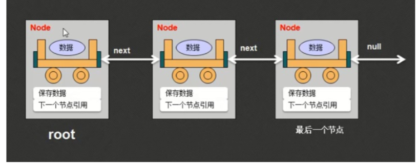

# 链表
形象的说 就像虾扯蛋，一个连着一个 。或者说像一个火车，一节节的车厢一样。  



```
class Node{
private String data; private Node next;
public Node(String data){
this.data=data; }
public void setNext(Node next){ this.next=next;
}
public Node getNext(){
return this.next; }
public String getData(){ return this.data;
} }
```
```
public class LinkDemo{
public static void main(String args[]){
Node root=new Node("火车头"); Node n1=new Node("车厢A"); Node n2=new Node("车厢B"); root.setNext(n1); n1.setNext(n2);
//取出所有数据
Node currentNode=root;//当前从根节点开始读取 while(currentNode!=null){//当前节点存在有数据
System.out.println(currentNode.getData());
currentNode=currentNode.getNext();//将下一个节点设置为当前节点 }
} }
`
```/使用递归方法
class Node{
private String data; private Node next;
public Node(String data){
this.data=data; }
public void setNext(Node next){ this.next=next;
}
public Node getNext(){
return this.next; }
public String getData(){ return this.data;
} }
```
```
public class LinkDemo{
public static void main(String args[]){
Node root=new Node("火车头"); Node n1=new Node("车厢A");
                    
 Node n2=new Node("车厢B"); root.setNext(n1); n1.setNext(n2);
print(root);
}
public static void print(Node current){
if(current==null){//递归结束条件 return;//结束方法
} System.out.println(current.getData());
print(current.getNext());
}
}
```
### 链表的定义与使用(链表基本实现)
```
class Node{
private String data; private Node next;
public Node(String data){
this.data=data; }
public void setNext(Node next){ this.next=next;
}
public Node getNext(){
return this.next; }
public String getData(){ return this.data;
}
//实现节点的添加 //第一次调用(Link):this=Link.root //第二次调用(Node):this=Link.root.next //第三次调用(Node):this=Link.root.next.next
public void addNode(Node newNode){ if(this.next==null){//当前节点的下一个为null;
this.next=newNode;//保存新节点 }else{
this.next.addNode(newNode); }
}
//第一次调用(Link):this=Link.root //第二次调用(Link):this=Link.root.next //第三次调用(Link):this=Link.root.next.next
public void printNode(){ System.out.println(this.data);//输出当前节点数据 if(this.next!=null){//现在还有下一个节点
this.next.printNode();//输出下一个 }
} }
```
```
class Link{//负责数据的设置和输出 private Node root;//根节点
public void add(String data){//增加数据
Node newNode=new Node(data); //为了可以设置数据的先后关系，所以将data包装在一个Node类对象里。 if(this.root==null){//一个链表只有一个根节点
this.root=newNode;//将新的节点设置为根节点 }else{//根节点已经存在了
this.root.addNode(newNode);//随后后面增加的元素应交由节点来决定。 }
}
public void print(){//输出数据
if(this.root!=null){//现在存在根节点 this.root.printNode();//交给Node类输出
} }
}
```
```
public class LinkDemo{
public static void main(String args[]){
Link link=new Link();//由这个类负责所有的数据操作 link.add("Hello"); //存放数据
link.add("World"); //存放数据
link.add("mldn"); //存放数据
link.add("www"); //存放数据
link.print(); //展示数据
} }
//Link类的主要功能是控制Node类对象产生和根节点 //Node类主要负责数据的保存以及引用关系的分配 //上述代码执行步骤————————————————————————————
//Node 负责节点，看到Node的属性先想到节点。Link 负责增加和输出。
//执行顺序:link.add("Hello");
//→public void add(String data)开始增加数据
//→this.root=newNode; 或者this.root.addNode(newNode); 从根节点开始，或 如果此节点已有数据，往下增加新节点。 //→public void addNode(Node newNode)增加新节点的方法，增加节点的对象。
   //→第一次调用 this=Link.root

 if(this.next==null){//当前节点的下一个为null; this.next=newNode;//保存新节点
}else{//当前节点之后还存在有节点，将值赋给新节点，如果节点后的节点之后还有节点怎么办?用递归 //第二次调用(Node):this=Link.root.next
//第三次调用(Node):this=Link.root.next.next
this.next.addNode(newNode); //→保存完毕该输出了public void print(){//输出数据
if(this.root!=null){//现在存在根节点 this.root.printNode();//交给Node类输出
}
//→public void printNode(){ //第一次调用(Link):this=Link.root System.out.println(this.data);//输出当前节点数据 //第二次调用(Link):this=Link.root.next //第三次调用(Link):this=Link.root.next.next
if(this.next!=null){//现在还有下一个节点 this.next.printNode();//用递归
```
输出下一个，下下个直到结束。
### 链表的定义与使用(确定程序结构)
//在开发具体的可用链表操作之前，首先必须明确一个道理:Node类负责所有节点数据的保存以及节点关系的匹配，所以Node类不可能单独去使用，而以上的实现里 Node类是可以单独使用的，外部可以绕过Link类直接操作Node类，这样明显是没有任何意义存在的。所以下面必须修改设计结构，让Node类只能被Link类使用。
//这个时候使用内部类明显是一个最好的选择。内部类可以使用private定义，这样一个内部类只能被一个外部类使用，另外一点，内部类可以方便与外部类之间进行 私有属性的直接访问。
//范例:链表的开发结构
```
class Link{//链表类，外部能够看见的只有这一个类
private class Node{//定义节点类，之所以定义在内部，主要是为Link类服务。
private String data; private Node next;
public Node(String data){
this.data=data; }
} //以上为内部类
private Node root;//需要根节点 }
public class LinkDemo{
public static void main(String args[]){
Node n=new Node("a"); }
} //随后主要就是进行代码的填充以及功能的完善。
```
### 链表的定义与使用(增加数据)
//如果要进行新数据的增加，则应该有Link类负责节点对象的产生，并且由Link类维护根节点，所有的节点的关系匹配交给Node类进行处理。 class Link{//链表类，外部能够看见的只有这一个类
```
private class Node{//定义节点类，之所以定义在内部，主要是为Link类服务。 private String data;
private Node next;
public Node(String data){
this.data=data; }
public void addNode(Node newNode){ if(this.next==null){
this.next=newNode; }else{//向后继续保存
this.next.addNode(newNode); }
} }
//以上为内部类
private Node root;//需要根节点
public void add(String data){//假设不允许有空值
if(data==null){ return;
}
Node newNode=new Node(data); if(this.root==null){//当前没有根节点
this.root=newNode;//保存根节点 }else{//根节点存在，其他节点交给Node类处理
           this.root.addNode(newNode);

 } }
}
public class LinkDemo{
public static void main(String args[]){ Link all=new Link(); all.add("Hello");
all.add("World");
all.add(null); }
}
//随后主要就是进行代码的填充以及功能的完善。 //此时使用了一个不许为null的判断，但并不是所有的链表都不许为null。
```
### 链表的定义与使用(取得链表长度)
//既然每一个链表对象都只有一个root根元素，那么每一个链表就有自己的长度，可以直接在Link 类里面设置一个count属性，随后每一次数据添加完成之后，可以进行个数的自增。 //范例:1、增加一个count属性。2、在add()方法里面增加数据的统计操作。3、随后为Link类增加一个size()方法
```
class Link{//链表类，外部能够看见的只有这一个类
private class Node{//定义节点类，之所以定义在内部，主要是为Link类服务。 private String data;
private Node next;
public Node(String data){
this.data=data; }
public void addNode(Node newNode){ if(this.next==null){
this.next=newNode; }else{//向后继续保存
this.next.addNode(newNode); }
} }
//以上为内部类
private Node root;//需要根节点
private int count=0;//保存元素的个数
public void add(String data){//假设不允许有空值
if(data==null){ return;
}
Node newNode=new Node(data); if(this.root==null){//当前没有根节点
this.root=newNode;//保存根节点 }else{//根节点存在，其他节点交给Node类处理
this.root.addNode(newNode); }
this.count++;//每次保存完成后，数据加1 }
public int size(){ return this.count;
} }
public class LinkDemo{
public static void main(String args[]){
Link all=new Link(); all.add("Hello"); all.add("World"); all.add(null); System.out.println(all.size());
} }
//随后主要就是进行代码的填充以及功能的完善。 //此时使用了一个不许为null的判断，但并不是所有的链表都不许为null。
```
### 链表的定义与使用(判断空链表)
```
//判断是否为空链表可以通过2种方式完成:1、判断root有对象(是否为空)，2、判断保存的数据量 class Link{//链表类，外部能够看见的只有这一个类
private class Node{//定义节点类，之所以定义在内部，主要是为Link类服务。 private String data;
private Node next;
public Node(String data){
this.data=data; }
public void addNode(Node newNode){ if(this.next==null){
this.next=newNode; }else{//向后继续保存
this.next.addNode(newNode); }
} }
//以上为内部类
private Node root;//需要根节点
private int count=0;//保存元素的个数
public void add(String data){//假设不允许有空值
if(data==null){ return;

 }
Node newNode=new Node(data); if(this.root==null){//当前没有根节点
this.root=newNode;//保存根节点 }else{//根节点存在，其他节点交给Node类处理
this.root.addNode(newNode); }
this.count++;//每次保存完成后，数据加1 }
public int size(){ return this.count;
}
public boolean isEmpty(){
return this.count==0; }
}
public class LinkDemo{
public static void main(String args[]){ Link all=new Link(); System.out.println(all.isEmpty()); all.add("Hello");
all.add("World");
all.add(null); System.out.println(all.size()); System.out.println(all.isEmpty());
} }
//随后主要就是进行代码的填充以及功能的完善。 //此时使用了一个不许为null的判断，但并不是所有的链表都不许为null。
```
### 链表的定义与使用(内容查询)
```
class Link{//链表类，外部能够看见的只有这一个类
private class Node{//定义节点类，之所以定义在内部，主要是为Link类服务。
private String data; private Node next;
public Node(String data){
this.data=data; }
public void addNode(Node newNode){ if(this.next==null){
this.next=newNode; }else{//向后继续保存
this.next.addNode(newNode); }
}
//第一次调用(Link):this=Link.root //第二次调用(Node):this=Link.root.next public boolean containsNode(String data){
if(data.equals(this.data)){//当前节点数据为要查询的数据 return true;//后面不再查询了
}else{//当前节点数据不满足查询 if(this.next!=null){//有后续节点
return this.next.containsNode(data); }else{//没有后续节点
return false;//没得查了 }
}
} }
//以上为内部类
private Node root;//需要根节点
private int count=0;//保存元素的个数
public void add(String data){//假设不允许有空值
if(data==null){ return;
}
Node newNode=new Node(data); if(this.root==null){//当前没有根节点
this.root=newNode;//保存根节点 }else{//根节点存在，其他节点交给Node类处理
this.root.addNode(newNode); }
this.count++;//每次保存完成后，数据加1 }
public int size(){ return this.count;
}
public boolean isEmpty(){
return this.count==0; }
public boolean contains(String data){ if(data==null||this.root==null){//现在没有要查询的数据，根节点也不保存数据
return false; }
return this.root.containsNode(data);
}
}
```
```
public class LinkDemo{

 public static void main(String args[]){ Link all=new Link();
all.add("Hello");
all.add("World"); System.out.println(all.contains("Hello")); System.out.println(all.contains("ayou"));
} }
//随后主要就是进行代码的填充以及功能的完善。 //此时使用了一个不许为null的判断，但并不是所有的链表都不许为null。
```
### 链表的定义与使用(根据索引取得数据)
```
class Link{
private class Node{
private String data; private Node next;
public Node(String data){
this.data=data; }
public void addNode(Node newNode){ if(this.next==null){
this.next=newNode; }else{
this.next.addNode(newNode); }
}
public boolean containsNode(String data){
if(data.equals(this.data)){ return true;
}else{ if(this.next!=null){
return this.next.containsNode(data); }else{
return false; }
} }
public String getNode(int index){ if(Link.this.foot++==index){//使用当前的foot内容与要查询的索引进行比较，随后将foot的内容自增是为了下次查询方便
return this.data; }else{
return this.next.getNode(index); }
}
}
private Node root;
private int count=0;
private int foot=0;
public void add(String data){
if(data==null){ return;
}
Node newNode=new Node(data); if(this.root==null){
this.root=newNode; }else{
this.root.addNode(newNode); }
count++; }
public int size(){ return this.count;
}
public boolean isEmpty(){
return this.count==0; }
public String get(int index){ if(index>=this.count){//超过了查询范围
return null;//没有数据 }
this.foot=0;//表示从前向后查询
return this.root.getNode(index);//将查询过程交给Node类处理 }
public boolean contains(String data){ if(data==null||this.root==null){
return false; }else{
return this.root.containsNode(data); }
} }
public class LinkDemo{
public static void main(String args[]){
Link all=new Link(); System.out.println(all.size()); System.out.println(all.isEmpty()); all.add("Hello"); all.add("World");

 all.add(null);
System.out.println(all.isEmpty()); System.out.println(all.contains("Hello")); System.out.println(all.contains("ayou")); System.out.println(all.get(0)); System.out.println(all.get(1)); System.out.println(all.get(2));//根据索引查询结果为null System.out.println(all.get(3));//根据索引查询结果为null
} }
```

### 链表的定义与使用(修改链表数据)
```
class Link{
private class Node{
private String data; private Node next;
public Node(String data){
this.data=data; }
public void addNode(Node newNode){ if(this.next==null){
this.next=newNode; }else{
this.next.addNode(newNode); }
}
public boolean containsNode(String data){
if(this.data.equals(data)){ return true;
}else{ if(this.next!=null){
return this.next.containsNode(data); }else{
return false; }
} }
public String getNode(int index){ if(Link.this.foot++==index){
return this.data; }else{
return this.next.getNode(index); }
}
public void setNode(int index,String data){ if(Link.this.foot++==index){
this.data=data; }else{
this.next.setNode(index,data); }
}
}
private Node root;
private int count=0;
private int foot=0;
public void add(String data){
Node newNode=new Node(data); if(this.root==null){
this.root=newNode; }else{
this.root.addNode(newNode); }
count++; }
public int size(){ return this.count;
}
public boolean isEmpty(){
return this.count==0; }
public boolean contains(String data){ if(data==null||this.root==null){
return false; }else{
return this.root.containsNode(data); }
}
public String get(int index){
if(this.count<=index){ return null;
}
this.foot=0;
return this.root.getNode(index);
}
public void set(int index,String data){ if(this.count<=index){
return; }
this.foot=0;
this.root.setNode(index,data); }
}
public class LinkDemo{
public static void main(String args[]){ Link all=new Link(); System.out.println(all.isEmpty()); System.out.println(all.size()); all.add("Hello");
all.set(0,"xiaoyu"); System.out.println(all.size()); System.out.println(all.isEmpty()); System.out.println(all.contains("Hello")); System.out.println(all.contains("We")); System.out.println(all.get(0)); System.out.println(all.get(1)); System.out.println(all.get(2));
} }

                 
```
                                                                    
### 链表的定义与使用(删除链表数据)
```
class Link{
private class Node{
private String data; private Node next;
public Node(String data){
this.data=data; }
public void addNode(Node newNode){ if(this.next==null){
this.next=newNode; }else{
this.next.addNode(newNode); }
}
public boolean containsNode(String data){
if(this.data.equals(data)){ return true;
}else{ if(this.next!=null){
return this.next.containsNode(data); }else{
return false; }
} }
public String getNode(int index){ if(Link.this.foot++==index){
return this.data; }else{
return this.next.getNode(index); }
}
public void setNode(int index,String data){
if(Link.this.foot++==index){ this.data=data;
}else{ this.next.setNode(index,data);
} }
public void removeNode(Node previous,String data){ if(data.equals(this.data)){
previous.next=this.next; }else{
this.next.removeNode(this,data); }
}
}
private Node root;
private int count=0;
private int foot=0;
public void add(String data){
Node newNode=new Node(data); if(this.root==null){
this.root=newNode; }else{
this.root.addNode(newNode); }
count++; }
public int size(){ return this.count;
}
public boolean isEmpty(){
return this.count==0; }
public boolean contains(String data){ if(data==null||this.root==null){
```
### 链表的定义与使用(对象数组转换)
//链表数据变为对象数组取出是最为重要的功能 //如果要想定义对象数组(以类为例)，可以采用如下的形式完成:
// 动态初始化:
//1、声明并开辟对象数组:类名称 对象数组名称[]=new 类名称[长度]
// 2、分步完成:
|-声明对象数组:类名称 对象数组名称[]=null; |-开辟对象数组:对象数组名称=new 类名称[长度];
```
class Link{
private class Node{
private String data; private Node next;
public Node(String data){
this.data=data; }
public void addNode(Node newNode){ if(this.next==null){
this.next=newNode; }else{
this.next.addNode(newNode); }
}
public boolean containsNode(String data){
if(this.data.equals(data)){ return true;
}else{ if(this.next!=null){
return this.next.containsNode(data); }else{
return false; }
} }
public String getNode(int index){ if(Link.this.foot++==index){
return this.data; }else{
return this.next.getNode(index); }
       return false; }else{
return this.root.containsNode(data); }
}
public String get(int index){
if(this.count<=index){ return null;
}
this.foot=0;
return this.root.getNode(index);
}
public void set(int index,String data){
if(this.count<=index){ return;
}
this.foot=0; this.root.setNode(index,data);
}
public void remove(String data){ if(this.contains(data)){
if(data.equals(this.root.data)){ this.root=this.root.next;
}else{ this.root.next.removeNode(this.root,data);
}
this.count--; }
} }
public class LinkDemo{
public static void main(String args[]){ Link all=new Link(); System.out.println(all.isEmpty()); System.out.println(all.size()); all.add("Hello");
all.add("World");
all.set(0,"xiaoyu");
all.remove("World"); System.out.println(all.size()); System.out.println(all.isEmpty()); System.out.println(all.contains("Hello")); System.out.println(all.contains("We")); System.out.println(all.get(0)); System.out.println(all.get(1)); System.out.println(all.get(2));
} }

 }
public void setNode(int index,String data){
if(Link.this.foot++==index){ this.data=data;
}else{ this.next.setNode(index,data);
} }
public void removeNode(Node previous,String data){ if(data.equals(this.data)){
previous.next=this.next; }else{
this.next.removeNode(this,data); }
}
public void toArrayNode(){ Link.this.retArray[Link.this.foot++]=this.data; if(this.next!=null){//有后续元素
this.next.toArrayNode(); }
}
}
private Node root;
private int count=0;
private int foot=0;
private String [] retArray;//返回的数组 public void add(String data){
Node newNode=new Node(data); if(this.root==null){
this.root=newNode; }else{
this.root.addNode(newNode); }
count++; }
public int size(){ return this.count;
}
public boolean isEmpty(){
return this.count==0; }
public boolean contains(String data){ if(data==null||this.root==null){
return false; }else{
return this.root.containsNode(data); }
}
public String get(int index){
if(this.count<=index){ return null;
}
this.foot=0;
return this.root.getNode(index);
}
public void set(int index,String data){
if(this.count<=index){ return;
}
this.foot=0; this.root.setNode(index,data);
}
public String [] toArray(){ if(this.root==null){
return null; }
this.foot=0;//需要脚标控制
this.retArray=new String[this.count];//根据保存内容开辟数组 this.root.toArrayNode();//交给Node类处理
return this.retArray;
}
public void remove(String data){ if(this.contains(data)){
if(data.equals(this.root.data)){ this.root=this.root.next;
}else{ this.root.next.removeNode(this.root,data);
}
this.count--; }
} }
public class LinkDemo{
public static void main(String args[]){ Link all=new Link(); System.out.println(all.isEmpty()); System.out.println(all.size()); all.add("Hello");
all.add("World");
all.add("nihao");
all.set(0,"xiaoyu");

 all.remove("World");
String [] data=all.toArray();
for (int x=0;x<data.length;x++){
System.out.println(data[x]); }
System.out.println(all.size()); System.out.println(all.isEmpty()); System.out.println(all.contains("Hello")); System.out.println(all.contains("We")); System.out.println(all.get(0)); System.out.println(all.get(1)); System.out.println(all.get(2));
} }
```
### 链表的定义与使用(链表使用)
```
class Book{
private String title;
private double price;
public Book(String title,double price){
this.title=title;
this.price=price; }
public String getInfo(){
return "图书名称:"+this.title+"，价格:"+this.price;
}
public boolean compare(Book book){
if(this==book){ return true;
} if(book==null){
return false; }
if(this.title.equals(book.title)&&this.price==book.price){ return true;
}
return false; }
}
class Link{
private class Node{
private Book data; private Node next; public Node(Book data){
this.data=data; }
public void addNode(Node newNode){ if(this.next==null){
this.next=newNode; }else{
this.next.addNode(newNode); }
}
public boolean containsNode(Book data){
if(data.compare(this.data)){ return true;
}else{ if(this.next!=null){
return this.next.containsNode(data); }else{
return false; }
} }
public Book getNode(int index){ if(Link.this.foot++==index){
return this.data; }else{
return this.next.getNode(index); }
}
public void setNode(int index,Book data){
if(Link.this.foot++==index){ this.data=data;
}else{ this.next.setNode(index,data);
} }
public void removeNode(Node previous,Book data){ if(data.compare(this.data)){
previous.next=this.next; }else{
this.next.removeNode(this,data); }
}
public void toArrayNode(){
Link.this.retArray[Link.this.foot++]=this.data; if(this.next!=null){//有后续元素
this.next.toArrayNode();

 } }
}
private Node root;
private int count=0;
private int foot=0;
private Book [] retArray;//返回的数组 public void add(Book data){
Node newNode=new Node(data); if(this.root==null){
this.root=newNode; }else{
this.root.addNode(newNode); }
count++; }
public int size(){ return this.count;
}
public boolean isEmpty(){
return this.count==0; }
public boolean contains(Book data){ if(data==null||this.root==null){
return false; }else{
return this.root.containsNode(data); }
}
public Book get(int index){
if(this.count<=index){ return null;
}
this.foot=0;
return this.root.getNode(index);
}
public void set(int index,Book data){
if(this.count<=index){ return;
}
this.foot=0; this.root.setNode(index,data);
}
public Book [] toArray(){
if(this.root==null){ return null;
}
this.foot=0;//需要脚标控制
this.retArray=new Book[this.count];//根据保存内容开辟数组 this.root.toArrayNode();//交给Node类处理
return this.retArray;
}
public void remove(Book data){
if(this.contains(data)){ if(data.compare(this.root.data)){
this.root=this.root.next; }else{
this.root.next.removeNode(this.root,data); }
this.count--; }
} }
public class LinkDemo{
public static void main(String args[]){ Link all=new Link();
all.add(new Book("Java开发",79.8));
all.add(new Book("Jsp开发",69.8));
all.add(new Book("Oracle开发",89.8)); System.out.println("保存书的个数:"+all.size()); System.out.println(all.contains(new Book("Java开发",79.8))); all.remove(new Book("Oracle开发",89.8));
Book [] books=all.toArray(); for(int x=0;x<books.length;x++){
System.out.println(books[x].getInfo()); }
} }
```
### 链表的定义与使用(在映射中使用链表)
```
class Province{
private int pid;
private String name;
private Link cities=new Link();
public Province(int pid,String name){ this.pid=pid;
this.name=name;
}
public boolean compare(Province province){
if(this==province){

 return true; }
if(province==null){ return false;
} if(this.pid==province.pid&&this.name.equals(province.name)){
return true; }
return false; }
public Link getCities(){ return this.cities;
}
public String getInfo(){
return "省份编号:"+this.pid+"，名称:"+this.name; }
}
class City{
private int cid;
private String name;
private Province province; public City(intcid,Stringname){
this.cid=cid;
this.name=name; }
public boolean compare(City city){ if(this==city){
return true; }
if(city==null){ return false;
} if(this.cid==city.cid
&&this.name.equals(city.name) &&this.province.compare(city.province)){ return true;
}
return false; }
public void setProvince(Province province){ this.province=province;
}
public Province getProvince(){
return this.province; }
public String getInfo(){
return "城市编号:"+this.cid+"，名称"+this.name;
} }
class Link{
private class Node{
private City data; private Node next; public Node(City data){
this.data=data; }
public void addNode(Node newNode){ if(this.next==null){
this.next=newNode; }else{
this.next.addNode(newNode); }
}
public boolean containsNode(City data){
if(data.compare(this.data)){ return true;
}else{ if(this.next!=null){
return this.next.containsNode(data); }else{
return false; }
} }
public City getNode(int index){ if(Link.this.foot++==index){
return this.data; }else{
return this.next.getNode(index); }
}
public void setNode(int index,City data){
if(Link.this.foot++==index){ this.data=data;
}else{ this.next.setNode(index,data);
} }
public void removeNode(Node previous,City data){ if(data.compare(this.data)){

 previous.next=this.next; }else{
this.next.removeNode(this,data); }
}
public void toArrayNode(){
Link.this.retArray[Link.this.foot++]=this.data; if(this.next!=null){//有后续元素
this.next.toArrayNode(); }
} }
private Node root;
private int count=0;
private int foot=0;
private City [] retArray;//返回的数组 public void add(City data){
Node newNode=new Node(data); if(this.root==null){
this.root=newNode; }else{
this.root.addNode(newNode); }
count++; }
public int size(){ return this.count;
}
public boolean isEmpty(){
return this.count==0; }
public boolean contains(City data){ if(data==null||this.root==null){
return false; }else{
return this.root.containsNode(data); }
}
public City get(int index){
if(this.count<=index){ return null;
}
this.foot=0;
return this.root.getNode(index);
}
public void set(int index,City data){
if(this.count<=index){ return;
}
this.foot=0; this.root.setNode(index,data);
}
public City [] toArray(){
if(this.root==null){ return null;
}
this.foot=0;//需要脚标控制
this.retArray=new City[this.count];//根据保存内容开辟数组 this.root.toArrayNode();//交给Node类处理
return this.retArray;
}
public void remove(City data){
if(this.contains(data)){ if(data.compare(this.root.data)){
this.root=this.root.next; }else{
this.root.next.removeNode(this.root,data); }
this.count--; }
} }
public class LinkDemo{
public static void main(String args[]){ Link all=new Link();
//设置关系数据
//1、先准备好各自独立的对象;
Province pro=new Province(1,"河北省");
City c1=new City(1001,"唐山");
City c2=new City(1002,"秦皇岛");
City c3=new City(1003,"石家庄");
c1.setProvince(pro);
c2.setProvince(pro);
c3.setProvince(pro);
pro.getCities().add(c1);
pro.getCities().add(c2);
pro.getCities().add(c3);
//取出关系
System.out.println(pro.getInfo()); System.out.println("拥有的城市数量:"+pro.getCities().size()); pro.getCities().remove(c1);

City c[]=pro.getCities().toArray(); for(int x=0;x<c.length;x++){
System.out.println(c[x].getInfo()); }
} }
```
### 总结: 在95%的操作情况下，链表里面有2个功能是最常用的，一个是增加，另一个是取得全部内容。
    
| No|方法名称|类型|描述 |      
|----|----|----|----|
|1|private void add(数据类型,变量)|普通|向链表之中增加新|
|2|public int size()|普通|取得链表中保存的元素个数|
|3|public boolean isEmpty()|普通|判断是否是空链表(size()==0)|
|4|public boolean contains(数据类型,变量)|普通|判断一个数据是否存在|
|5|public 数据类型 get(int index)|普通|根据索引取得数据|
|6|public void set(int index,数据类型 变量)|普通|使用新的内容替换掉指定索引的旧内容|
|7|public void remove(数据类型 变量)|普通|删除指定数据，如果是对象，则要进行对象比较|
|8|public 数据类型 [] toArray()|普通|将链表以对象数组的形式返回|


