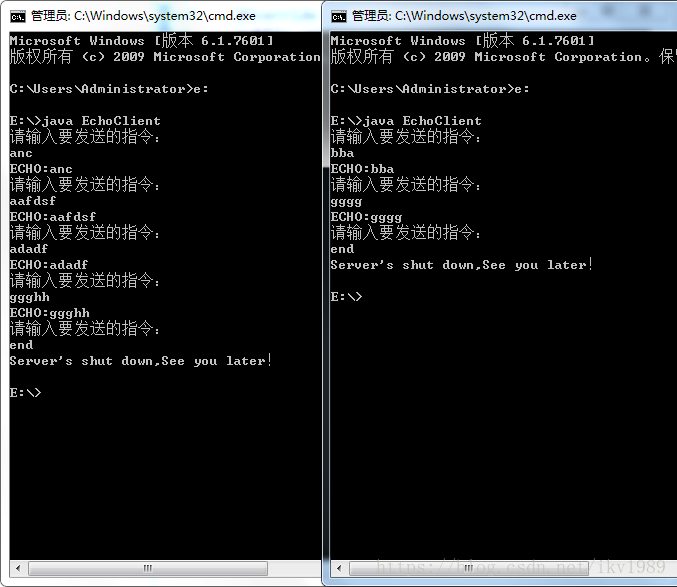

本程序设计如下：

·由于需要采用多次输入形式，所以不能够每次连接后立刻关闭服务器端；

·可以设置一个字符串：如果输入"end",那么才结束本次的Echo操作；

范例1：定义服务器端
```
import java.io.IOException;
import java.io.PrintStream;
import java.net.ServerSocket;
import java.net.Socket;
import java.util.Scanner;
 
class EchoThread implements Runnable {
	private Socket client;
 
	public EchoThread(Socket client) {
		this.client = client;
	}
 
	@Override
	public void run() {
		try {
			Scanner scan = new Scanner(client.getInputStream());
			PrintStream out = new PrintStream(client.getOutputStream());
			boolean flag = true;// 控制多次连接操作
			while (flag) {
				if (scan.hasNext()) {
					String str = scan.next().trim();// 得到客户端发送的信息
					if ("end".equalsIgnoreCase(str)) {// 程序结束条件
						out.println("Server's shut down,See you later！");
						flag = false;// 退出循环
					} else {// 应该回应输入信息
						out.println("ECHO:" + str);
					}
				}
			}
			scan.close();
			out.close();
		} catch (IOException e) {
			e.printStackTrace();
		}
	}
}
 
public class EchoServer {
	public static void main(String[] args) throws Exception {// 此处直接抛错
		ServerSocket server = new ServerSocket(9999);
		System.out.println("等待客户端连接....");
		boolean flag = true;
		while (flag) {
			Socket cilent = server.accept();// 等待客户端连接
			new Thread(new EchoThread(cilent)).start();
		}
		server.close();
 
	}
 
}
```

范例2：定义客户端
```
import java.io.PrintStream;
import java.net.Socket;
import java.util.Scanner;
 
public class EchoClient {
 
	public static void main(String[] args) throws Exception {// 直接抛出异常
		Socket client = new Socket("localhost", 9999);// 连接服务器端
		Scanner input = new Scanner(System.in);
		Scanner scan = new Scanner(client.getInputStream());
		PrintStream out = new PrintStream(client.getOutputStream());
		input.useDelimiter("\n");
		scan.useDelimiter("\n");
		boolean flag = true;
		while (flag) {
			System.out.println("请输入要发送的指令：");
			if (input.hasNext()) {
				String str = input.next().trim();
				out.println(str);// 发送服务器数据
				if ("end".equalsIgnoreCase(str)) {
					flag = false;// 循环结束
				}
				if (scan.hasNext()) {
					System.out.println(scan.next());// 输出回应数据
				}
			}
		}
		input.close();
		scan.close();
		out.close();
		client.close();
	}
 
}
```




实现简单的服务器端与客户端通讯。
单线程的网络应用，实际中不可能如此进行，所以为了能够让一个服务器端 可以同时处理多个客户端的操作，使用多线程描述。
把每一个连接到服务器端的客户都作为一个独立的线程对象保留。

服务开发的基础要素：网络支持类、IO、多线程

总结：对于网络编程首先要明确一点是：很少回去进行它的实际开发。所以作为了解一下。重要的是要清楚多线程在服务器上的作用
