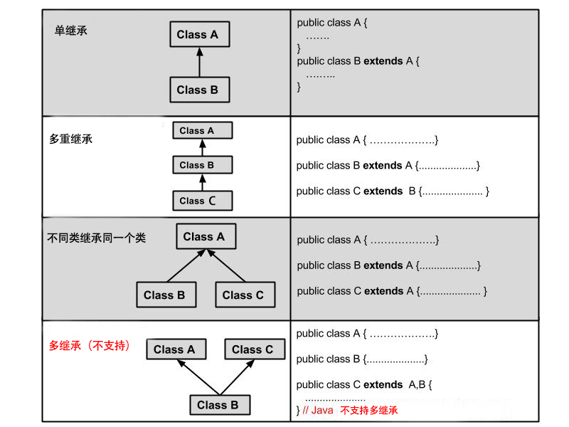

## 继承的概念


继承是java面向对象编程技术的一块基石，因为它允许创建分等级层次的类。

继承就是子类继承父类的特征和行为，使得子类对象（实例）具有父类的实例域和方法，或子类从父类继承方法，使得子类具有父类相同的行为。

生活中的继承：


兔子和羊属于食草动物类，狮子和豹属于食肉动物类。

食草动物和食肉动物又是属于动物类。

所以继承需要符合的关系是：is-a，父类更通用，子类更具体。

虽然食草动物和食肉动物都是属于动物，但是两者的属性和行为上有差别，所以子类会具有父类的一般特性也会具有自身的特性。

类的继承格式
在 Java 中通过 extends 关键字可以申明一个类是从另外一个类继承而来的，一般形式如下：

类的继承格式
class 父类 {
}
 
class 子类 extends 父类 {
}
为什么需要继承
接下来我们通过实例来说明这个需求。

开发动物类，其中动物分别为企鹅以及老鼠，要求如下：

企鹅：属性（姓名，id），方法（吃，睡，自我介绍）
老鼠：属性（姓名，id），方法（吃，睡，自我介绍）
企鹅类：
```
public class Penguin { 
    private String name; 
    private int id; 
    public Penguin(String myName, int  myid) { 
        name = myName; 
        id = myid; 
    } 
    public void eat(){ 
        System.out.println(name+"正在吃"); 
    }
    public void sleep(){
        System.out.println(name+"正在睡");
    }
    public void introduction() { 
        System.out.println("大家好！我是"         + id + "号" + name + "."); 
    } 
}
```
老鼠类：
```
public class Mouse { 
    private String name; 
    private int id; 
    public Mouse(String myName, int  myid) { 
        name = myName; 
        id = myid; 
    } 
    public void eat(){ 
        System.out.println(name+"正在吃"); 
    }
    public void sleep(){
        System.out.println(name+"正在睡");
    }
    public void introduction() { 
        System.out.println("大家好！我是"         + id + "号" + name + "."); 
    } 
}
```
从这两段代码可以看出来，代码存在重复了，导致后果就是代码量大且臃肿，而且维护性不高(维护性主要是后期需要修改的时候，就需要修改很多的代码，容易出错)，所以要从根本上解决这两段代码的问题，就需要继承，将两段代码中相同的部分提取出来组成 一个父类：

公共父类：
```
public class Animal { 
    private String name;  
    private int id; 
    public Animal(String myName, int myid) { 
        name = myName; 
        id = myid;
    } 
    public void eat(){ 
        System.out.println(name+"正在吃"); 
    }
    public void sleep(){
        System.out.println(name+"正在睡");
    }
    public void introduction() { 
        System.out.println("大家好！我是"         + id + "号" + name + "."); 
    } 
}
```
这个Animal类就可以作为一个父类，然后企鹅类和老鼠类继承这个类之后，就具有父类当中的属性和方法，子类就不会存在重复的代码，维护性也提高，代码也更加简洁，提高代码的复用性（复用性主要是可以多次使用，不用再多次写同样的代码） 继承之后的代码：

企鹅类：
```
public class Penguin extends Animal { 
    public Penguin(String myName, int myid) { 
        super(myName, myid); 
    } 
}
```
老鼠类：
```
public class Mouse extends Animal { 
    public Mouse(String myName, int myid) { 
        super(myName, myid); 
    } 
}
```
继承类型
需要注意的是 Java 不支持多继承，但支持多重继承。



继承的特性
子类拥有父类非 private 的属性、方法。

子类可以拥有自己的属性和方法，即子类可以对父类进行扩展。

子类可以用自己的方式实现父类的方法。

Java 的继承是单继承，但是可以多重继承，单继承就是一个子类只能继承一个父类，多重继承就是，例如 A 类继承 B 类，B 类继承 C 类，所以按照关系就是 C 类是 B 类的父类，B 类是 A 类的父类，这是 Java 继承区别于 C++ 继承的一个特性。

提高了类之间的耦合性（继承的缺点，耦合度高就会造成代码之间的联系越紧密，代码独立性越差）。

继承关键字
继承可以使用 extends 和 implements 这两个关键字来实现继承，而且所有的类都是继承于 java.lang.Object，当一个类没有继承的两个关键字，则默认继承object（这个类在 java.lang 包中，所以不需要 import）祖先类。

extends关键字
在 Java 中，类的继承是单一继承，也就是说，一个子类只能拥有一个父类，所以 extends 只能继承一个类。

extends 关键字
public class Animal { 
    private String name;   
    private int id; 
    public Animal(String myName, String myid) { 
        //初始化属性值
    } 
    public void eat() {  //吃东西方法的具体实现  } 
    public void sleep() { //睡觉方法的具体实现  } 
} 
 
public class Penguin  extends  Animal{ 
}
implements关键字
使用 implements 关键字可以变相的使java具有多继承的特性，使用范围为类继承接口的情况，可以同时继承多个接口（接口跟接口之间采用逗号分隔）。

implements 关键字
public interface A {
    public void eat();
    public void sleep();
}
 
public interface B {
    public void show();
}
 
public class C implements A,B {
}
super 与 this 关键字
super关键字：我们可以通过super关键字来实现对父类成员的访问，用来引用当前对象的父类。

this关键字：指向自己的引用。

实例
class Animal {
  void eat() {
    System.out.println("animal : eat");
  }
}
 
class Dog extends Animal {
  void eat() {
    System.out.println("dog : eat");
  }
  void eatTest() {
    this.eat();   // this 调用自己的方法
    super.eat();  // super 调用父类方法
  }
}
 
public class Test {
  public static void main(String[] args) {
    Animal a = new Animal();
    a.eat();
    Dog d = new Dog();
    d.eatTest();
  }
}
输出结果为：

animal : eat
dog : eat
animal : eat
final关键字
final 关键字声明类可以把类定义为不能继承的，即最终类；或者用于修饰方法，该方法不能被子类重写：

声明类：

final class 类名 {//类体}
声明方法：

修饰符(public/private/default/protected) final 返回值类型 方法名(){//方法体}
注:实例变量也可以被定义为 final，被定义为 final 的变量不能被修改。被声明为 final 类的方法自动地声明为 final，但是实例变量并不是 final

构造器
子类是不继承父类的构造器（构造方法或者构造函数）的，它只是调用（隐式或显式）。如果父类的构造器带有参数，则必须在子类的构造器中显式地通过 super 关键字调用父类的构造器并配以适当的参数列表。

如果父类构造器没有参数，则在子类的构造器中不需要使用 super 关键字调用父类构造器，系统会自动调用父类的无参构造器。

实例
```
class SuperClass {
  private int n;
  SuperClass(){
    System.out.println("SuperClass()");
  }
  SuperClass(int n) {
    System.out.println("SuperClass(int n)");
    this.n = n;
  }
}
```
```
// SubClass 类继承
class SubClass extends SuperClass{
  private int n;
  
  SubClass(){ // 自动调用父类的无参数构造器
    System.out.println("SubClass");
  }  
  
  public SubClass(int n){ 
    super(300);  // 调用父类中带有参数的构造器
    System.out.println("SubClass(int n):"+n);
    this.n = n;
  }
}
```
```
// SubClas2 类继承
class SubClass2 extends SuperClass{
  private int n;
  
  SubClass2(){
    super(300);  // 调用父类中带有参数的构造器
    System.out.println("SubClass2");
  }  
  
  public SubClass2(int n){ // 自动调用父类的无参数构造器
    System.out.println("SubClass2(int n):"+n);
    this.n = n;
  }
}
public class TestSuperSub{
  public static void main (String args[]){
    System.out.println("------SubClass 类继承------");
    SubClass sc1 = new SubClass();
    SubClass sc2 = new SubClass(100); 
    System.out.println("------SubClass2 类继承------");
    SubClass2 sc3 = new SubClass2();
    SubClass2 sc4 = new SubClass2(200); 
  }
}
```
输出结果为：
```
------SubClass 类继承------
SuperClass()
SubClass
SuperClass(int n)
SubClass(int n):100
------SubClass2 类继承------
SuperClass(int n)
SubClass2
SuperClass()
SubClass2(int n):200
```


子类我们可以叫做派生类，父类又叫做原类在继承中我们用关键字extends，子类可以完全的继承父类的所有的东西，同事他自己还可以进行扩展
class 子类 extends 父类 {}

继承的限制
1.java不允许多重继承关系
C++中的多继承概念：一个子类可以直接继承多个父类
class A{}
class B{}
class C extends A,B
多继承的目的在于一个子类可以直接继承多个父类的操作方法，所以我们在C++语言中才采用多继承这种功能，我们在java中可以使用使用多层继承：
class A {}
class B extends A {}
class C extends B {}
这样C类就能使用A和B类的操作方法了，在开发中多层继承最好不要超过三层，java允许多层继承关系。
2. 子类在继承父类时，就继承了父类的所有方法和属性（field），私有的属性和方法是隐式继承的，不能被直接使用（可以间接调用），非私有的属性和方法是显式继承的，可以直接使用（这是我们需要注意的一个点）。
3.在子类的对象构造之前一定会默认调用父类的无参构造方法，也就是在其的构造方法中一定会先执行父类对象的无参构造方法：super()
如果说子类的父类中不存在无参构造方法，我们必须在子类构造方法中的首行中加入父类的有参构造方法。
this()和super()的使用
两个全部要放在首行，假设在一个构造方法中存在this()，这时就不存在super()
可是我们说this()假设调用自己，这个构造方法是不存在出口的，可是假设this()调用其它的构造方法，这个构造方法也必须隐含着首行的代码super()，在这种构造函数不是一个不存在出口的递归形式时，在其的出口构造函数一定会调用super().


### 继承性(继承问题的引出)
```
class Student{
private String name;
private int age;
private String school;
public void setName(String name){
this.name=name; }
public void setAge(int age){ this.age=age;
}
public void setSchool(String school){
this.school=school; }
public String getName(){ return this.name;
}
public int getAge(){
return this.age; }
public String getSchool(){ return this.school;
} }
class Person{
private String name;
private int age;
public void setName(String name){
this.name=name; }
public void setAge(int age){ this.age=age;
}
public String getName(){
return this.name; }
public int getAge(){ return this.age;
} }
public class TestDemo{
public static void main(String args[]){
} }
```
### 继承性(继承的实现)
```
class Person{
private String name;
private int age;
public void setName(String name){
this.name=name; }
public void setAge(int age){ this.age=age;
}

 public String getName(){ return this.name;
}
public int getAge(){
return this.age; }
}
class Student extends Person{//继承了Person父类
private String school;
public void setSchool(String school){
this.school=school; }
public String getSchool(){ return this.school;
} }
public class TestDemo{
public static void main(String args[]){
Student stu=new Student();
stu.setName("阿尤");
stu.setAge(24);
stu.setSchool("家里蹲大学"); System.out.println("姓名:"+stu.getName()+"，年龄:"+stu.getAge()+"，学校:"+stu.getSchool());
} }
```
### 继承性(继承的限制)
//Java不允许多重继承，可以多层继承，开发角度而言，不要超过3层。 //子类在继承父类的时候严格来讲会继承父类的所有操作，但是对于所有的私有操作属于隐式继承，而所有的非私有操作属于显式继承。
```
class A{
private String msg;
public void setMsg(String msg){
this.msg=msg; }
public String getMsg(){ return this.msg;
} }
class B extends A{
//public void fun(){
// System.out.println(msg);//因为msg为私有属性，属于隐式继承，不能被操作，编译无法通过。 //}
}
```
```
public class TestDemo{
public static void main(String args[]){ B b=new B();
b.setMsg("Hello"); System.out.println(b.getMsg());
} }
class A{ public A(){
System.out.println("A-A类的构造方法"); }
}
class B extends A{
public B(){
super ();//父类中有无参构造是，加与不加无区别。
System.out.println("B-B类的构造方法"); }
}
public class TestDemo{
public static void main(String args[]){
new B();//此时并没有任何的操作代码，但发现，在实例化子类对象前先去实例化了父类对象以及调用了父类的无参构造方法。那么此时对于子类构造而言，就相当于隐藏了一
个"super()"。 }
}
//如果此时父类中没有无参构造方法了，那么就必须使用super()明确调用父类的有参构造方法。 class A{
public A(String title){ System.out.println("A-A类的构造方法");
} }
class B extends A{ public B(String title){
super(title);
System.out.println("B-B类的构造方法"); }
}

 public class TestDemo{
public static void main(String args[]){
new B("Hello"); }
}
//通过观察super()主要是由子类调用父类中的构造方法，那么这行语句一定要放在子类构造方法的首行。这一点和this()是类似的。那么这两个同时出现呢? //通过代码验证:super()与this()不能同时出现，不管子类怎么折腾，它都永恒有一个存在的前提:子类对象的构造调用前一定先执行父类构造，为父类的对象初始化后，才轮到子类对象初始 化。
```
### 覆写(方法覆写)
```
class A{
public void fun(){
System.out.println("A-A类的fun()方法"); }
}
class B extends A{
}
public class TestDemo{
public static void main(String args[]){ B b=new B();
b.fun();
} }
//下面开始覆写 class A{
public void fun(){ System.out.println("A-A类的fun()方法");
} }
class B extends A{
public void fun(){ System.out.println("B-B类的fun()方法");
}
}
public class TestDemo{
public static void main(String args[]){ B b=new B();
b.fun();
} }
class A{
public void fun(){
System.out.println("A-A类的fun方法"); }
}
class B extends A{
public void fun(){ System.out.println("B-B类的fun方法");
} }
class C extends A{ public void fun(){
System.out.println("C-C类的fun方法"); }
}
public class TestDemo{
public static void main(String args[]){ B b=new B();
b.fun();
C c=new C();
c.fun(); }
}
class A{
public void fun(){
print(); }
private void print(){ System.out.println("大家下午辛苦了，瞌睡的同学请站到教室后面去。");
} }
class B extends A{ public void print(){
System.out.println("姜同学自己罚站了"); }
}
public class TestDemo{
public static void main(String args[]){ B b=new B();
b.fun();
b.print(); }
} //这个时候发现子类中根本就没有复写print()方法，也就是说如果使用了private声明，那么这个方法对子类而言是不可见的，就算子类顶一个了一个与之完全相同的符合于覆写要求的方法， 那么也不能够发生覆写。实际上就相当于子类自

class A{
public void print(){
System.out.println("大家下午辛苦了，瞌睡的同学请站到教室后面去。"); }
}
class B extends A{
public void print(){ //this.print();//出现递归调用死循环。 super.print(); System.out.println("姜同学自己罚站了");
} }
public class TestDemo{
public static void main(String args[]){
B b=new B();
b.print(); }
} //使用this.方法()会首先查找本类中是否存在要有调用的方法名称，如果存在则直接调用，如果不存在则查找父类中是否具备有次方法，如果有就调用，如果没有，则会发生编译时的错误提 示;
//使用super.方法()，明确的表示调用的不是子类方法(不查找子类中是否存在有此方法，而直接调用父类中的此方法。)
```
|No|区别 | 重载  |  覆写 |
|----|----|----|----|
|1|英文单词|Overloading|Override|
|2|发生范围|发生在一个类里|发生在继承关系中|
|3|定义|方法名称相同，参数的类型及个数相 同，返回值类型可以不同但不建议。|方法名称相同，参数的类型及个 数相同，方法返回值相同|
|4|权限|没有权限的限制| 被覆写的方法不能拥有比父类更 严格的访问控制权限。|
### 覆写(属性覆盖)
```
class A{
String info="Hello";
}
class B extends A{
int info=100; public void print(){
System.out.println(info);
System.out.println(super.info); }
}
public class TestDemo{
public static void main(String args[]){ B b=new B();
b.print();
} }
//1、在以后的开发中，强烈建议在本类或者父类中加上"this."或者"super."，这样好区分。 //2、如果子类中要用父类指定的方法，但是发现父类的方法实现不能满足子类要求的时候就要使用覆写来完善子类的功能，同时保留父类的方法名称。 //3、被子类覆写的方法不能拥有比父类更严格访问控制权限。
```
| NO|区别| this|super |
|-----|-----|----|----|
|1|功能|调用本类构造、本类方法、本类属性|子类调用父类构造、父类方法、父类 属性|
|2|形式|先查找本类中是否存在有指定的调用结 构，如果有则直接调用，如果没有则调 用父类定义。|不查找子类，直接调用父类操作|
|3|特殊|表示本类的当前对象|不能单独使用|
 