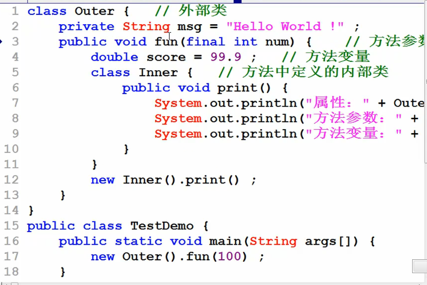
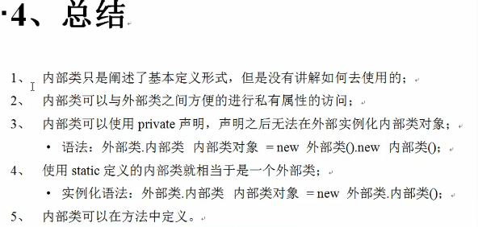

# 内部类

尽量不要定义内部类;
类主要是参数和方法
好处 :内部类可以直接访问外部类的私有属性 ,外部内,也可以通过内部类的对象访问内部类的私有属性;
用了内部类后私有属性的访问变得简单,　　　可以在外部内中定义ｆｕｎ（）方法创建内部类对象；

访问属性要使用this  但是在内部类中访问外部类要注意  使用"外部类.this.属性"访问外部类种的普通属性；
内部类的实例化语法
外部类.内部类  对象名 = new  外部类.new  内部类();

如果一个内部类,只希望被一个外部类调用,不能够呗外部调用  ,那么可以使用private 定义;
内部类的实例化语法
外部类.内部类  对象名 = new  外部类.new  内部类();

使用static  定义的属性或者方法不受到类实例化对象的控制
使用static 的话 那么定义的内部类相当于一个外部类,并且只能使用外部类中使用static 定义的属性和方法;
static  方法只能访问static　属性　；
如果想要定义一个内部类对象可以使用    外部类.内部类  对象名 = new  外部类.内部类();

在方法中定义内部类：

方法中的内部类可以访问方法的参数以及定义的变量， 但是这种操作只适用于JDK1.8之后的版本，JDK1,7以及之前的版本有一个严格的要求;方法中定义的内部类如果要想访问方法定义的参数以及定义的变量，那么参数或变量前一定要加上“final”标记。

1.在方法中也可以定义内部类  
2.方法中定义的内部类可以访问外部类的成员变量和方法  
3.方法中的内部类也可以访问方法中的参数和属性但是要注意以下几点  
-在JDK1.8之前内部类要访问方法中的参数和属性时需要在参数和属性前面加上“final”关键字（非正规）  
- JDK1.8之后final关键字可以省略  
4.方法中定义内部类在以后用的比较多  

## 需要整理。。。
class Outer{
private String msg="Hello World!"; class Inner{//定义了一个内部类
public void print(){ System.out.println(msg);
} }
public void fun(){
 new Inner().print();//实例化内部类对象，并且调用print()方法。 }
}
public class TestDemo{
public static void main(String args[]){ Outer out=new Outer();//实例化外部类对象 out.fun();//调用外部类方法
} }
//如果把内部类Inner拿出来，但是要实现同样的功能。 //下列代码折腾了半天，最终目的只有一个，让内部类可以访问外部类中定义的一个私有的msg属性内容。
class Outer{
private String msg="Hello World!"; public String getMsg(){
return this.msg; }
public void fun(){
new Inner(this).print();//实例化内部类对象，并且调用print()方法。
} }
class Inner{
private Outer out; public Inner(Outer out){
this.out=out; }
public void print(){ System.out.println(this.out.getMsg());
} }
public class TestDemo{
public static void main(String args[]){
Outer out=new Outer();//实例化外部类对象
out.fun();//调用外部类方法 }
} //内部类有一个最大的优点，可以方便的访问外部类的私有操作。但是，反之外部类也可以访问内部类的私有属性。 //范例:
class Outer{
private String msg="Hello World!"; class Inner{//定义了一个内部类
private String info="世界，你好!"; public void print(){
System.out.println(msg); }
}
public void fun(){
Inner in=new Inner();//内部类对象
System.out.println(in.info);//直接利用了内部类对象访问了内部类的私有属性 }
}
public class TestDemo{
public static void main(String args[]){ Outer out=new Outer();//实例化外部类对象 out.fun();//调用外部类方法
} }
class Outer{
private String msg="Hello World!"; class Inner{//定义了一个内部类
public void print(){ System.out.println(Outer.this.msg);//外部类的当前对象，不加Outer只用this.就只是本类。
} }
public void fun(){
new Inner().print();//内部类对象
System.out.println(in.info);//直接利用了内部类对象访问了内部类的私有属性 }
}
public class TestDemo{
public static void main(String args[]){ Outer out=new Outer();//实例化外部类对象 out.fun();//调用外部类方法
} }
//外部类.内部类 对象=new 外部类().new 内部类() //上述表达式为:内部类对象(在外部)的实例化语法 //范例:内部类对象实例化,一定先实例化外部类对象
class Outer{
private String msg="Hello World!"; class Inner{//定义了一个内部类
public void print(){ System.out.println(Outer.this.msg);//
}
  
 } }
public class TestDemo{
public static void main(String args[]){
Outer.Inner in=new Outer().new Inner();//实例化内部类对象
in.print(); }
}
//如果一个内部类只希望被一个外部类访问，不希望被外部调用，可以在前面加private，例如: class Outer{
private String msg="Hello World!";
private class Inner{//定义了一个内部类
public void print(){ System.out.println(Outer.this.msg);//
} }
}
public class TestDemo{
public static void main(String args[]){
//Outer.Inner in=new Outer().new Inner();//此句编译时会出错，因为无法调用。 //in.print();
} }
章节17 课时 63 03044_内部类(static定义内部类)
//使用static定义的属性或者方法是不受到实例化对象控制的。如果使用static定义内部类，那么它不会受到外部类的实例化对象控制。 //如果一个内部类使用了static定义的话，那么这个内部类就变为了外部类，且只能访问外部类中定义的static操作。相当于定义了一个外部类。 class Outer{
private static String msg="Hello World!";//如果不加static，则内部类无法调用此属性。因为内部类前加了static。 static class Inner{//使用static定义了一个内部类
public void print(){ System.out.println(msg);
} }
}
public class TestDemo{
public static void main(String args[]){
Outer.Inner in=new Outer.Inner();//此时不再需要先产生外部类对象，再产生内部类对象，仿佛成了一个独立的类。 in.print();
} }
章节17 课时 64 03045_内部类(方法中定义内部类)
//内部类只是阐述了基本定义形式，但是没有讲解如何去使用的 //2、内部类可以与外部类之间方便的进行私有属性的访问 //3、内部类可以使用private声明，声明之后无法再外部实例化背部类对象。 //语法:外部类.内部类 内部类对象=new外部类().new内部类(); //4、使用static定义的内部类就相当于一个外部类。
//语法:外部类.内部类 内部类对象=new外部类.内部类(); //5、内部类可以在方法中定义。
class Outer{
private String msg="Hello World!"; public void fun(){
class Inner{//方法中定义内部类 public void print(){
System.out.println("属性:"+Outer.this.msg); }
}
new Inner().print();//实例化Inner类对象，并调用print方法。 }
}
public class TestDemo{
public static void main(String args[]){
new Outer().fun();//实例化Outer类对象，并调用fun()方法。
} }
//方法中定义内部类如上，但是方法里面会接受参数，也会定义变量。上述代码可以访问吗?请看下方: class Outer{
private String msg="Hello World!"; public void fun(int num){//方法参数
double score=99.9;//方法变量 class Inner{//方法中定义内部类
public void print(){ System.out.println("属性:"+Outer.this.msg); System.out.println("方法参数:"+num); System.out.println("方法变量:"+score);
} }
new Inner().print();//实例化Inner类对象，并调用print方法。 }
}
public class TestDemo{
public static void main(String args[]){
new Outer().fun(100);//实例化Outer类对象，并调用fun()方法。
} }
                
//此时发现没有加入任何的修饰，方法中的内部类可以访问方法的参数以及定义的变量，但是这种操作只适合于JDK18之后的版本。1.7及之前的版本有一个严格要求:方法中定义的内部类如 果想要访问方法的参数或者方法定义的变量，那么参数或变量前一定要加上"final"标记。
class Outer{
private String msg="Hello World!"; public void fun(final int num){//方法参数
final double score=99.9;//方法变量 class Inner{//方法中定义内部类
public void print(){ System.out.println("属性:"+Outer.this.msg); System.out.println("方法参数:"+num); System.out.println("方法变量:"+score);
} }
new Inner().print();//实例化Inner类对象，并调用print方法。 }
}
public class TestDemo{
public static void main(String args[]){
new Outer().fun(100);//实例化Outer类对象，并调用fun()方法。
} }
  