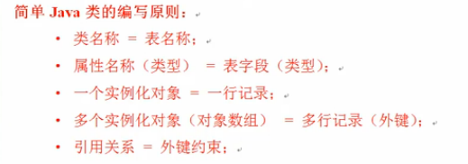

# 内部类

尽量不要定义内部类;
类主要是参数和方法
好处 :内部类可以直接访问外部类的私有属性 ,外部内,也可以通过内部类的对象访问内部类的私有属性;
用了内部类后私有属性的访问变得简单,　　　可以在外部内中定义ｆｕｎ（）方法创建内部类对象；

访问属性要使用this  但是在内部类中访问外部类要注意  使用"外部类.this.属性"访问外部类种的普通属性；
内部类的实例化语法
外部类.内部类  对象名 = new  外部类.new  内部类();

如果一个内部类,只希望被一个外部类调用,不能够呗外部调用  ,那么可以使用private 定义;
内部类的实例化语法
外部类.内部类  对象名 = new  外部类.new  内部类();

使用static  定义的属性或者方法不受到类实例化对象的控制
使用static 的话 那么定义的内部类相当于一个外部类,并且只能使用外部类中使用static 定义的属性和方法;
static  方法只能访问static　属性　；
如果想要定义一个内部类对象可以使用    外部类.内部类  对象名 = new  外部类.内部类();

在方法中定义内部类：

方法中的内部类可以访问方法的参数以及定义的变量， 但是这种操作只适用于JDK1.8之后的版本，JDK1,7以及之前的版本有一个严格的要求;方法中定义的内部类如果要想访问方法定义的参数以及定义的变量，那么参数或变量前一定要加上“final”标记。

1.在方法中也可以定义内部类  
2.方法中定义的内部类可以访问外部类的成员变量和方法  
3.方法中的内部类也可以访问方法中的参数和属性但是要注意以下几点  
-在JDK1.8之前内部类要访问方法中的参数和属性时需要在参数和属性前面加上“final”关键字（非正规）  
- JDK1.8之后final关键字可以省略  
4.方法中定义内部类在以后用的比较多  