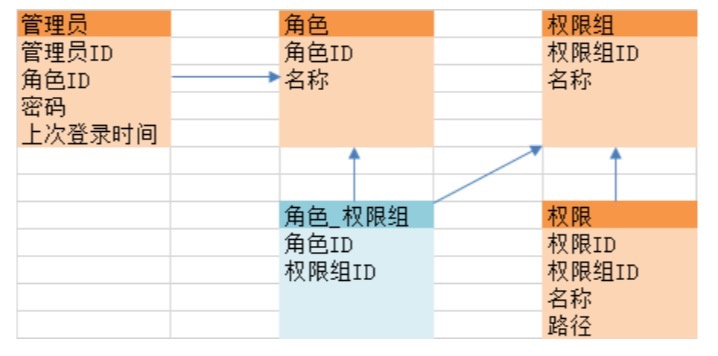

##  表与 java 类的映射

### 数据表与简单Java类映射
```
class Dept{
private int deptno;
private String dname;
private String loc;
private Emp emps [];
public void setEmps(Emp [] emps){//int data[]=new int[5];举例说明，5是长度。
this.emps=emps; }
public Emp[] getEmps(){ return this.emps;
}
public Dept(int deptno,String dname,String loc){
this.deptno=deptno; this.dname=dname; this.loc=loc;
}
public String getInfo(){
return "部门编号:"+this.deptno+"，部门名称:"+this.dname+"，位置:"+this.loc; }
}
```
```
class Emp{
private int empno;
private String ename;
private String job;
private double sal;
private double comm;
private Dept dept;
private Emp mgr;
public void setMgr(Emp mgr){
this.mgr=mgr; }
public Emp getMgr(){ return this.mgr;
}
public void setDept(Dept dept){
this.dept=dept; }
public Dept getDept(){ return this.dept;
}
public Emp(int empno,String ename,String job,double sal,double comm){ this.empno=empno;
this.ename=ename;
this.job=job;
this.sal=sal;
this.comm=comm; }
public String getInfo(){
return "雇员编号:"+this.empno+"，雇员姓名:"+this.ename+"，工作"+this.job+"，工资:"+this.sal+"，小费:"+this.comm;
} }
```
```
public class TestDemo{
public static void main(String args[]){ //第一步:设置数据 //1、产生各自的独立对象
Dept dept=new Dept(10,"ACCOUNTING","New York");//财务部 Emp ea=new Emp(1234,"SMITH","CLERK",800.0,0.00);
Emp eb=new Emp(2345,"FORD","MANAGER",2450.0,0.00); Emp ec=new Emp(3456,"KING","PRESIDENT",5000.0,0.00);
//2、设置雇员和领导的关系 ea.setMgr(eb); eb.setMgr(ec);
//3、设置雇员和部门的关系 ea.setDept(dept);
eb.setDept(dept);
ec.setDept(dept); dept.setEmps(new Emp[]{ea,eb,ec});
//取出数据，根据给定结构取出数据，要求如下: //可以根据一个雇员查询他所对应的领导信息和部门信息; //可以根据一个部门取出所有雇员以及每个雇员的领导信息; //第二部:取出数据
//1、通过雇员找到领导信息和部门信息 System.out.println(ea.getInfo()); System.out.println("\t|- "+ea.getMgr().getInfo()); System.out.println("\t|- "+ea.getDept().getInfo());
//2、根据部门找到所有的雇员以及每个雇员的领导信息 System.out.println("————————————————————————————————————"); System.out.println(dept.getInfo());
for(int x=0;x<dept.getEmps().length;x++){
System.out.println("\t|- "+dept.getEmps()[x].getInfo()); if(dept.getEmps()[x].getMgr()!=null){
System.out.println("\t\t|- "+dept.getEmps()[x].getMgr().getInfo()); }
  }
 } }
 ```
### 一对多映射(省份-城市)
```
class Province{
private int pid;
private String name;
private City cities[];
public Province(int pid,String name){ this.pid=pid;
this.name=name;
}
public void setCities(City cities[]){
this.cities=cities; }
public City[] getCities(){ return this.cities;
}
public String getInfo(){
return "省份编号:"+this.pid+"，名称:"+this.name; }
}
```
```
class City{
private int cid;
private String name;
private Province province; public City(intcid,Stringname){
this.cid=cid;
this.name=name; }
public void setProvince(Province province){ this.province=province;
}
public Province getProvince(){
return this.province; }
public String getInfo(){
return "城市编号:"+this.cid+"，名称"+this.name;
} }
public class TestPc{
public static void main(String args[]){
//设置关系数据 //1、先准备好各自独立的对象;
Province pro=new Province(1,"河北省");
City c1=new City(1001,"唐山");
City c2=new City(1002,"秦皇岛");
City c3=new City(1003,"石家庄"); c1.setProvince(pro);
c2.setProvince(pro);
c3.setProvince(pro);
pro.setCities(new City[]{c1,c2,c3}); //取出关系数据 System.out.println(c1.getProvince().getInfo()); for(int x=0;x<pro.getCities().length;x++){
System.out.println(pro.getCities()[x].getInfo()); }
} }
```

### 双向一对多映射(类型-子类型-商品)
```
class Item{
private int iid;
private String name;
private String note;
private Subitem subitems[];
private Product products[];
public Item(int iid,String name,String note){
this.iid=iid; this.name=name; this.note=note;
}
public void setSubitems(Subitem subitems[]){
this.subitems=subitems; }
public Subitem[] getSubitems(){ return this.subitems;
}
public void setProducts(Product products[]){
this.products=products; }
public Product[] getProducts(){ return this.products;
}
public String getInfo(){
return "栏目编号:"+this.iid+"，名称:"+this.name+"，描述:"+this.note; }
}
```
```
class Subitem{
private int sid; private String name;
  
 private String note;
private Item item;
private Product products[];
public Subitem(int sid,String name,String note){
this.sid=sid; this.name=name; this.note=note;
}
public void setItem(Item item){
this.item=item; }
public Item getItem(){ return this.item;
}
public void setProducts(Product products[]){
this.products=products; }
public Product[] getProducts(){ return this.products;
}
public String getInfo(){
return "子栏目编号:"+this.sid+"，名称:"+this.name+"，描述:"+this.note; }
}
```
```
class Product{
private int pid;
private String name;
private double price;
private Item item;
private Subitem subitem;
public Product(int pid,String name,double price){
this.pid=pid; this.name=name; this.price=price;
}
public void setItem(Item item){
this.item=item; }
public Item getItem(){ return this.item;
}
public void setSubitem(Subitem subitem){
this.subitem=subitem; }
public Subitem getSubitem(){ return this.subitem;
}
public String getInfo(){
return "产品编号:"+this.pid+"，名称:"+this.name+"，价格:"+this.price; }
}
```
```
public class TestIsp{
public static void main(String args[]){
Item item=new Item(1,"厨房用具","-");
Subitem suba=new Subitem(1001,"厨具","-");
Subitem subb=new Subitem(1001,"刀具","-");
Subitem subc=new Subitem(1001,"餐具","-");
Product proa=new Product(2001,"菜刀",1000);
Product prob=new Product(2002,"水果刀",1000);
Product proc=new Product(3001,"蒸锅",1000);
Product prod=new Product(3002,"汤锅",1000);
Product proe=new Product(4001,"青花瓷",1000);
Product prof=new Product(4002,"竹筷",1000); suba.setItem(item);
subb.setItem(item);
subc.setItem(item);
item.setSubitems(new Subitem[]{suba,subb,subc}); proa.setItem(item);
prob.setItem(item);
proc.setItem(item);
prod.setItem(item);
proe.setItem(item);
prof.setItem(item);
proa.setSubitem(suba);
prob.setSubitem(suba);
proc.setSubitem(subb);
prod.setSubitem(subb);
proe.setSubitem(subc);
prof.setSubitem(subc);
suba.setProducts(new Product[]{proa,prob}); subb.setProducts(new Product[]{proc,prod}); subc.setProducts(new Product[]{proe,prof}); item.setProducts(new Product[]{proa,prob,proc,prod,proe,prof});
//通过一个类型找到对应的全部子类 System.out.println(item.getInfo());
for(int x=0;x<item.getSubitems().length;x++){
System.out.println("\t|- "+item.getSubitems()[x].getInfo()); }
System.out.println("————————————————————————————————————"); //通过一个类型找到它所对应的全部商品，以及每个商品对应的子类型。
System.out.println(item.getInfo());

 for(int y=0;y<item.getProducts().length;y++){
System.out.println("\t|- "+item.getProducts()[y].getInfo()); System.out.println("\t\t|- "+item.getProducts()[y].getSubitem().getInfo());
}
System.out.println("————————————————————————————————————"); //通过一个子类型找到所有对应的全部商品。
System.out.println(suba.getInfo());
for(int x=0;x<suba.getProducts().length;x++){
System.out.println("\t|- "+suba.getProducts()[x].getInfo()); }
} }
```
### 多对多映射(管理员-角色-组-权限)

```
//一个角色有多个管理员，一个管理员属于一个角色  
//一个角色有多个权限，一个权限对应多个角色 
class Admin{
private String aid;
private String password;
private Role role;
public Admin(String aid,String password){
this.aid=aid;
this.password=password; }
public void setRole(Role role){ this.role=role;
}
public Role getRole(){
return this.role; }
public String getInfo(){
return "管理员编号:"+this.aid+"，密码:"+this.password;
} }
```
```
class Role{
private int rid;
private String title;
private Admin admins[]; private Group groups[]; public Role(int rid,String title){
this.rid=rid;
this.title=title; }
public void setAdmins(Admin [] admins){ this.admins=admins;
}
public Admin [] getAdmins(){
return this.admins; }
public void setGroups(Group [] groups){ this.groups=groups;
}
public Group[] getGroups(){
return this.groups; }
public String getInfo(){
return "角色编号:"+this.rid+"，角色名称:"+this.title;
} }
```
```
class Group{
private int gid;
private String title;
private Role roles[];
private Action actions[];
public Group(int gid,String title){
this.gid=gid;
this.title=title; }
public void setRoles(Role [] roles){ this.roles=roles;
}
public Role[] getRoles(){
return this.roles; }
public void setActions(Action [] actions){ this.actions=actions;
 
 }
public Action [] getActions(){
return this.actions; }
public String getInfo(){
return "权限组编号:"+this.gid+"，名称:"+this.title;
} }
```
```
class Action{
private int aid;
private String title;
private String url;
private Group group;
public Action(int aid,String title,String url){
this.aid=aid; this.title=title; this.url=url;
}
public void setGroup(Group group){
this.group=group; }
public Group getGroup(){ return this.group;
}
public String getInfo(){
return "权限编号:"+this.aid+"，名称:"+this.title+"，路径:"+this.url; }
}
public class TestAdmin{
public static void main(String args[]){ Admin a1=new Admin("admin","hello"); Admin a2=new Admin("mldn","hello"); Admin a3=new Admin("ayou","hello"); Role r1=new Role(1,"系统管理员");
Role r2=new Role(2,"信息管理员");
Group g1=new Group(10,"信息管理");
Group g2=new Group(11,"用户管理");
Group g3=new Group(12,"数据管理");
Group g4=new Group(13,"接口管理");
Group g5=new Group(14,"备份管理");
Action ac01=new Action(1001,"新闻发布","-"); Action ac02=new Action(1002,"新闻列表","-"); Action ac03=new Action(1003,"新闻审核","-"); Action ac04=new Action(1004,"增加用户","-"); Action ac05=new Action(1005,"用户列表","-"); Action ac06=new Action(1006,"登录日志","-"); Action ac07=new Action(1007,"雇员数据","-"); Action ac08=new Action(1008,"部门数据","-"); Action ac09=new Action(1009,"公司数据","-"); Action ac10=new Action(1010,"服务传输","-"); Action ac11=new Action(1011,"短信平台","-"); Action ac12=new Action(1012,"全部备份","-"); Action ac13=new Action(1013,"局部备份","-"); //设置对象的基本关系
//设置管理员与角色
a1.setRole(r1);
a2.setRole(r2);
a3.setRole(r2);
r1.setAdmins(new Admin[]{a1}); r2.setAdmins(new Admin[]{a2,a3}); //设置角色与管理组
r1.setGroups(new Group[]{g1,g2,g3,g4,g5}); r2.setGroups(new Group[]{g1,g2}); g1.setRoles(new Role[]{r1,r2}); g2.setRoles(new Role[]{r1,r2}); g3.setRoles(new Role[]{r1}); g4.setRoles(new Role[]{r1}); g5.setRoles(new Role[]{r1}); //管理员组与权限
g1.setActions(new Action[]{ac01,ac02,ac03}); g2.setActions(new Action[]{ac04,ac06,ac06}); g3.setActions(new Action[]{ac07,ac08,ac09}); g4.setActions(new Action[]{ac10,ac11}); g5.setActions(new Action[]{ac12,ac13}); ac01.setGroup(g1);
ac02.setGroup(g1);
ac03.setGroup(g1);
ac04.setGroup(g2);
ac05.setGroup(g2);
ac06.setGroup(g2);
ac07.setGroup(g3);
ac08.setGroup(g3);
ac09.setGroup(g3);
ac10.setGroup(g4);
ac11.setGroup(g4);
ac12.setGroup(g5);
ac13.setGroup(g5);
//取出数据
System.out.println("——————————————————————————————"); //可以根据一个管理员找到他所对应的角色，以及每个角色包含的所有权限组的信息，每个权限组所包含所有权限的内容。 System.out.println(a1.getInfo());

System.out.println("\t|- "+a1.getRole().getInfo()); for(int x=0;x<a1.getRole().getGroups().length;x++){
System.out.println("\t\t|- "+a1.getRole().getGroups()[x].getInfo());
for(int y=0;y<a1.getRole().getGroups()[x].getActions().length;y++){System.out.println("\t\t\t|- "+a1.getRole().getGroups()[x].getActions()[y].getInfo()); }
} System.out.println("——————————————————————————————"); //根据一个权限组找到具备此权限组的角色以及每个角色所拥有的管理员信息 System.out.println(g2.getInfo());
for(int x=0;x<g2.getRoles().length;x++){
System.out.println("\t|- "+g2.getRoles()[x].getInfo()); for(int y=0;y<g2.getRoles()[x].getAdmins().length;y++){
System.out.println("\t\t|- "+g2.getRoles()[x].getAdmins()[y].getInfo()); }
} }
}
```
