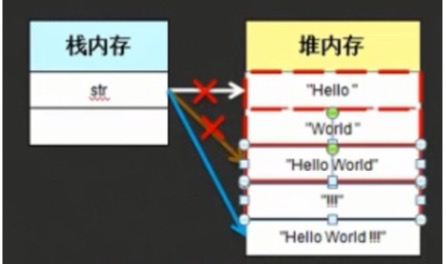

## 字符串内容不可改变
```
public class StringDemo{
public static void main(String args[]){
String str="Hello "; str=str+"World"; str+="!!!"; System.out.println(str);
} }
```
//字符串内容不可改变，改变的只是堆内存地址的指向，且每一次改变都会产生垃圾空间。如下图


```
public class StringDemo{
public static void main(String args[]){
String str="";
for(int x=0;x<1000;x++){
str+=x;//任何类型和String类型相加时都会变为String类型，所以str会变成一长串数字字符且产生999块垃圾空间。 }
System.out.println(str); }
}

```