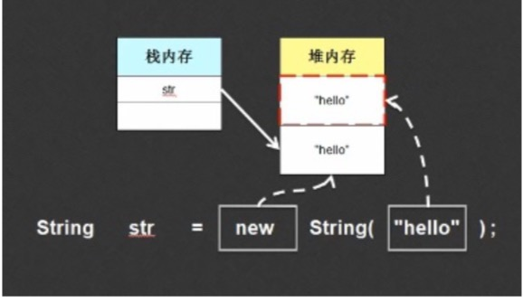

## String类对象的两种实例化方式

String str="Hello World";//直接赋值
String str=new String("Hello World");//构造方法实例化


## 两种实例化方式的区别

```
public class StringDemo{
public static void main(String args[]){
String stra="hello";
String strb="hello";
String strc="hello"; System.out.println(stra==strb); System.out.println(stra==strc); System.out.println(strb==strc);
} }

```
//String类直接进行赋值时，值会存入对象池，下次如果再进行String类的直接赋值且相等时，直接引用该栈内存。
//String str=new String("hello");如果使用的是构造方法的方式进行String类对象实例化的时候，程序默认从右往左执行，那么最终的操作形式就变成了开辟2块堆内存空间(其中有一块堆内 从空间将成为垃圾)


```
public class StringDemo{
public static void main(String args[]){
String stra="hello";
String strb=new String ("hello"); System.out.println(stra==strb);
} }
``` 
  如果采用构造方法定义String类，其值不会入对象池，可以采用String类的一个方法:手工入池。public String intern;
```
public class StringDemo{
public static void main(String args[]){
String stra=new String ("hello").intern();//使用了构造方法定义了新的内存空间，而后入池。 String strb="hello";
System.out.println(stra==strb);
} }

```


## String常量为匿名对象
java中什么是匿名对象?
普通声明一个对象是这样的
Aa =new A(); 那么这个时候a就是类A的一个对象，这个对象名字就是a 再来看下面一个例子:
method(A a); 整理method是一个方法，他需要传递一个对象来作为参数，那么这个时候有2种方法: 方法1:
A a =new A(); method (a);
方法2:
method (new A());
方法2中new A()就是一个匿名对象，他没有名字。这样可以理解了吧。
```
public class StringDemo{
public static void main(String args[]){
String str="Hello";//给匿名对象起了一个名字str("Hello"是一个匿名对象)。但str不是对象名称，声明对象并实例化StringDemo strd=new StringDemo(); System.out.println("Hello".equals(str));
}
}
```
```
public class StringDemo{
public static void main(String args[]){
String input="Hello";
if(input.equals("Hello")){//字符串是否相等 ，用input调用了equals()方法
System.out.println("Hello World!"); }
} }
```
```
public class StringDemo{
public static void main(String args[]){
String input=null; if("Hello".equals(input)){//如果要判断输入的内容是否某一字符串，请一定要将字符串写在前面。equals()可以回避空指向异常。
System.out.println("Hello World!"); }
} }
```