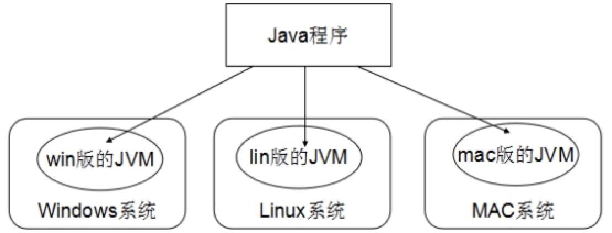

## Java概述
## 1.什么是java
Java是sun公司，1995年推出的一门高级编程语言。Sun的全称是Stanford University Network，斯坦福大学网络公司的简称。
Sun公司目前已经被Oracle公司收购了，Oracle是世界上第二大的软件公司（2013年，甲骨文已超越 IBM ，成为继 Microsoft 后全球第二大软件公司），但是这不影响Java的发展。为什么呢？因为Java开源的、Java跨平台的。所以很多公司愿意支持Java。包括大家用的Android系统，Android系统的应用软件都是有Java开发的。
那么，Java语言是怎么诞生的呢？
在1990年末，Sun公司预计在发达国家，消费类电子产品会有一个大的发展，所以成立了一个Green项目小组，专门研究这类产品的通用控制环境。
这个团队最初考虑的是使用C++语言进行开发，但是这样会存在很大的问题，而且可以使用的资源极其有限，所以James Glosling决定创造一种新的语言，这就是Java语言的前身：Oak。
后来，由于各种原因，Green项目几近夭折，这么新语言就没有得到推广。
1994年，互联网和浏览器的出现给Oak语言带来了新的生机。Gosling对Oak进行了小规模的改造，并进行注册。但是在注册的时候发现Oak这个商标已经被注册了，所以只得将Oak更名为Java。
到了95年的时候，Sun公司发布了Java语言，并把它放到互联网上，给大家免费使用，甚至连源代码也在互联网上公开了。
几个月后，Java成为互联网上最热门的宝贝。有10万多人次访问了Sun公司的网页，并下载Java一样，然后互联网立即有数不清的Java小程序，演示各种小动画、小游戏等。
Java也就成为了广为人知的编程语言。
1995年，Sun公司虽然推出了Java语言，但这只是一种语言，如果想要开发复杂的应用程序，必须要有一个强大的开发类库。因此，Sun在96年的时候发布了JDK1.0.这个版本包括两个部分：运行环境（即JRE）和开发环境（即JDK）。
到了98年12月，Sun发布了Java的历史上最重要的JDK版本JDK1.2，并且将Java分为了J2EE、J2SE、J2ME三个版本，我们在大数据的应用中用到的就是标准版。
到了2004年10月，Sun发布了JDK1.5，同时将JDK1.5改名为Java SE 5.0，J2EE、J2ME也相应的改名为Java EE和Java ME。JDK1.5增加了很多新特性，如泛型、增强的for语句、可变参数、注解、自动拆箱和自动装箱的功能。
到了2009年的时候，Sun公司被Oracle公司收购了。
2011年，Oracle发布了Java SE 7，这个版本是Oracle发布的第一个版本。
2014年，又发布了Java SE 8，这是Java的最新版本。8.0版本，添加了一些新特性，比如函数式接口，就是Java 8 的一个新特性。这个版本的Java跟Scala有些相似。
## 2.Java的跨平台性
Java的核心特性是跨平台。
什么是跨平台性呢？跨平台性就是通过Java语言编写的应用程序在不同的系统平台上都可以运行。
只要在需要运行java应用程序的操作系统上，安装一个Java虚拟机(JVM Java Virtual Machine)就可以实现java的跨平台特性。
Java 通过 JVM（Java 虚拟机） 实现了跨平台技术，Java 源代码（*.java）经过 Java的编译器编译成 Java 字节码（*.class）,执行 Java 字节码，Java 字节码经过 JVM 的解释为具体平台的具体指令，并执行。不同平台有不同的 JVM，主流平台都提供了 JVM（比如 Windows、 Linux、主流手机操作系统）。所以 Java字节码可以在所有平台上能够解释执行。在这个意义上 Java 是跨平台的。也就是说：Java 的字节码是跨平台的。
Java 是跨平台的，JVM 不是跨平台的（需要强调的，没有 JVM，Java 是不能运行的）。

因为有了JVM，所以同一个Java程序在不同的操作系统中都可以执行。这样就实现了Java程序的跨平台性。也称为Java具有良好的可移植性。
## 3.Java的版本  
Java有三个版本，它们分别是标准版、企业版、微型版。
J2SE(Java SE，Java 2 Platform Standard Edition)，在Java 5.0后，更名为JavaSE.主要用户开发客户端，桌面应用软件，例如常用的文本编辑器、下载软件、扫雷等等（打开扫雷游戏玩一玩），这些都可以使用J2SE实现。J2SE包含了Java的核心类库，例如数据库连接、接口定义、输入/输出、网络编程等，所以说学习Java编程就从J2SE入手。
J2EE(Java EE，Java 2 Platform Enterprise Edition)，是Java的企业版。是功能最为丰富的一个版本，主要用于开发高访问量、大数据量、高并发量的网站。美团、去哪儿网的后台都是J2EE。
J2ME(Java ME，Java 2 Platform Micro Edition)，微型版，是用来开发电子消费产品和嵌入式设备的。在智能手机还没有进入公众视野的时候，摩托罗拉、诺基亚手机上有很多Java小游戏都是是用J2ME开发的。
我们要用到的是java SE的内容，所以我们今后主要学习的方向就是Java SE。